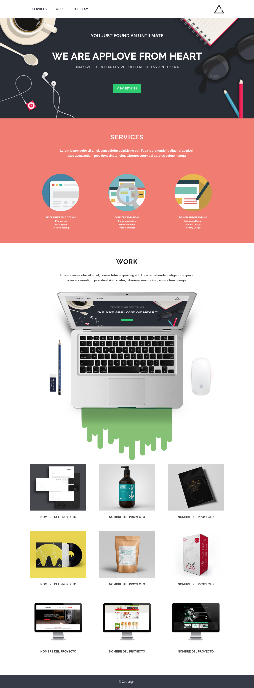

# AppLove

## Introdução

O projeto AppLove foi desenvolvido a partir de um template inicial que indicava os requisitos de elementos (texto e imagem) e estilos a serem utilizados. O desafio era replicar o template com o máximo de fidelidade.

## Objetivos

1. Replicar o site **AppLove** a partir do template abaixo:

2. Estruturar a página e linkar o arquivo CSS em um arquivo HTML. Utilizar HTML semântico corretamente com tags apropriadas para cada conteúdo, além de nomear classes, ids e etc. coerentemente;

3. Utilizar CSS para conferir estilo ao projeto, com seletores adequados;

4. Garantir indentação e clareza no código.